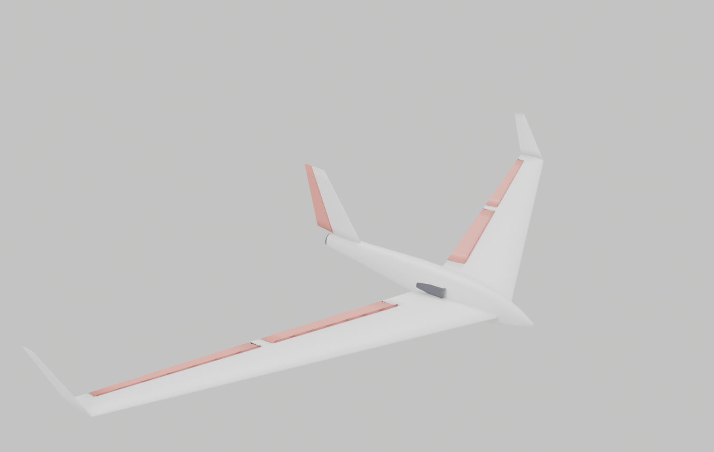
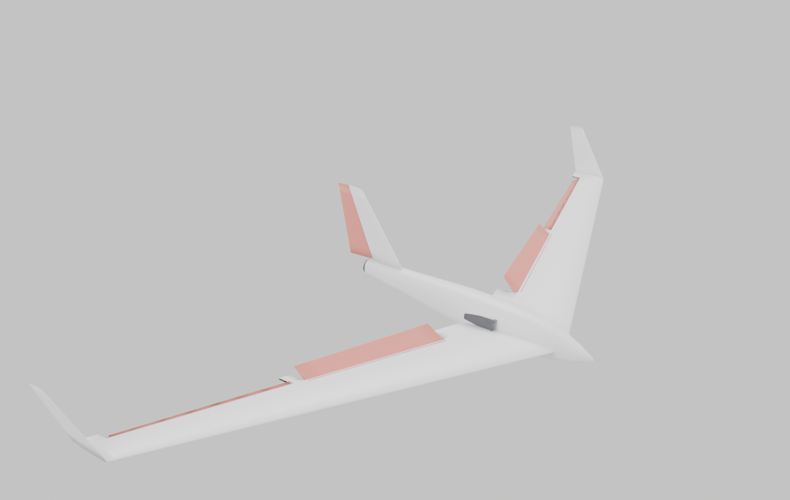
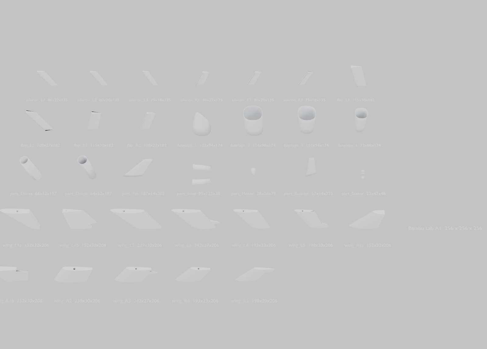
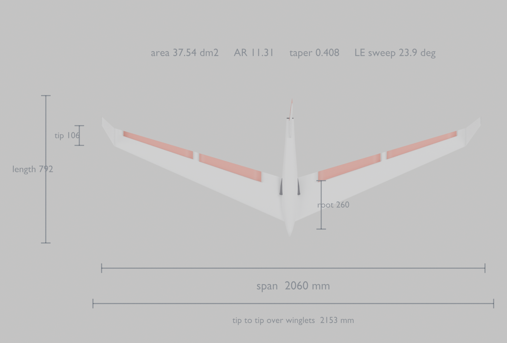
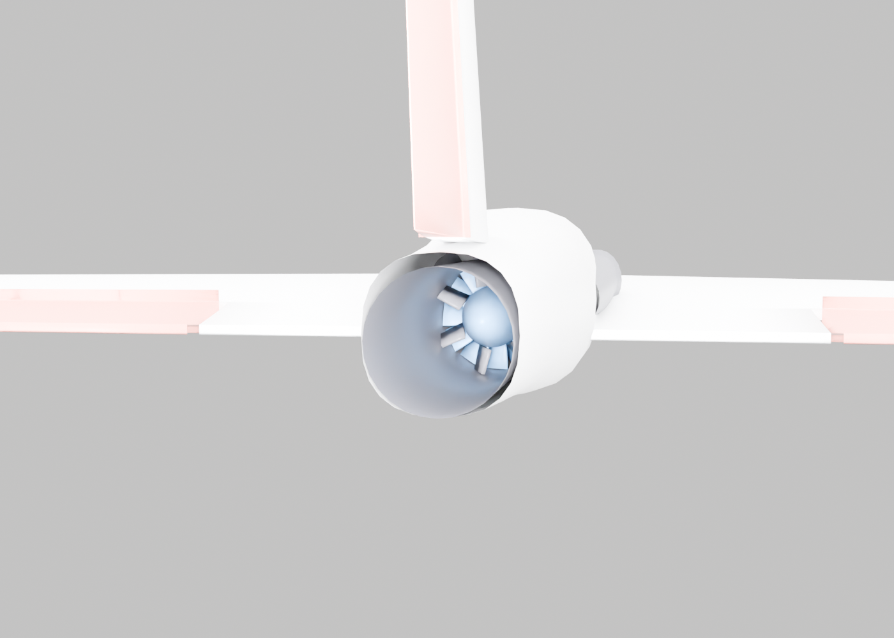

# Planes in Blender



```
blender/jetwing.py          the swept flying wing (2060 mm BIG WING)
blender/jetwing.blend       ready to open
blender/basic_plane.py      a simple conventional trainer
blender/basic_plane.blend
blender/render_jetwing.py   camera, lights, previews, saves the .blend
blender/render_preview.py   the same, for the trainer
```

## Running

**Any Blender version:** `blender --python blender/jetwing.py`

Opening a `.blend` directly needs **Blender 5.0+**, because the pip `bpy` that
built them is 5.0.1. On 4.x you get a version error — run the `.py` instead,
which works back to 2.8 and gives the identical model.

**No Blender at all:** `pip install bpy && python3 blender/render_jetwing.py`
(Cycles on CPU; EEVEE needs a display.)

## Working control surfaces

Four flaps and a rudder, each a separate object whose origin sits **on its
hinge line**, with the local axis running **along** that line. The hinges are
swept, so they are not parallel to any world axis — the rest frame is stored
on each object as `hinge_origin` / `hinge_basis` / `hinge_axis` (visible in
Blender's Object Properties → Custom Properties) and the deflection is
composed with it:

```python
import jetwing
jetwing.set_controls(flap=40, aileron=-32, rudder=22)   # crow brake + yaw
jetwing.set_controls(elevator=-8)                       # both pairs up
jetwing.set_controls()                                  # neutral
```

`elevator` adds to **both** pairs, which is how a flying wing gets pitch out
of surfaces that are already doing something else.



## Printing it

**`jetwing-parts.blend` — open this one for the parts.** All 33 pieces, each
standing in its print orientation on z = 0, laid out on a grid and labelled
with its name and size, plus an A1 build volume drawn to one side for scale.
The assembled aircraft is in an `Assembled` collection, hidden; tick it back
on in the Outliner to see it whole.

To get a single part out: select it, **File > Export > STL**, tick *Selection
Only*. Or skip Blender entirely and use the ready-made STLs in `print/`.




`blender/print_parts.py` is what cuts the aircraft into **33 parts, all inside a
256 mm cube and all watertight**, bores the stepped spar channel and writes
`print/*.stl`. See [docs/PRINTING.md](../docs/PRINTING.md) for the carbon
sizes and the assembly order.


## Dimensions, and checking them

`blender/measure.py` measures the **evaluated mesh, after modifiers, in world
space** and compares it with the specification, exiting non-zero if anything
is out. `blender/render_dims.py` draws the dimensions onto a plan view, reading
them off the measured geometry rather than off the parameters -- so if the two
ever disagree, the drawing shows the truth.



Tip chord and washout are outputs of `tools/optimise.py`, which solves the
span loading by lifting-line theory. See [docs/OPTIMISATION.md](../docs/OPTIMISATION.md).

## The EDF

Fixed 50 mm unit, fully faired, nothing retracting: bellmouth inlets with a
3.1 mm lip radius, a 1.2 deg diffuser, a 12-blade rotor, a 7-vane stator to
take the swirl back out, motor can with a closing tailcone, and a 40.5 mm
converging nozzle. Sizing and the reasoning are in
[docs/EDF.md](../docs/EDF.md); every dimension is an output of
`tools/edf.py`.



## What is copied and what is not

planeprint.com and the mirror of its assembly manual are both blocked by this
session's network policy, so no geometry file was ever available. These
figures are from the published specification, which search did reach:

| | |
|---|---|
| span | 1270 mm standard / **2060 mm BIG WING** ← built here |
| flight weight | 860–1750 g |
| wing loading | 28–48 g/dm² |
| power | EDF 70 mm on 4S, or glider |
| channels | 4/6, **four flaps**, butterfly/crow |
| variants | with or without a steerable rudder; the rudder version has *"integrated vector control"* |
| printing | 200 mm cube, LW-PLA + PLA |

Wing **area** is not published. 36.5 dm² is chosen because it is the one value
that makes all four published numbers land exactly:

```
1022 g -> 28.0 g/dm2        1750 g -> 48.0 g/dm2
```

and it lets both wings share one 260 mm root chord, which a modular kit with a
common fuselage joint has to do.

**Sweep, taper, aerofoil and CG are published nowhere.** Those are designed
from the aerodynamics — a reflexed section with washout so the wing trims
itself without a tailplane — not copied. So this is a faithful model, not a
replica. Real dimensions go straight into the `P` dictionary at the top of
`jetwing.py`.

## Structure

Everything is lofted from parametric sections, so the shape is in the maths
rather than in vertex soup:

| | |
|---|---|
| `section()` | NACA 4-digit camber + a trailing-edge reflex term |
| `chord_at` / `le_at` / `twist_at` | planform and washout at any station |
| `place()` | puts a unit-chord section into 3D at a spanwise station |
| `datum()` | one rotation applied to **vertices**, so fuselage, duct and fin share a frame |
| `hinge_frame()` | world position and axes of a swept hinge line |

`datum()` being applied to vertices rather than to objects is deliberate: a
rotated pod and an unrotated fin drift apart and the fin ends up floating in
mid-air, which is exactly what the first attempt did.
