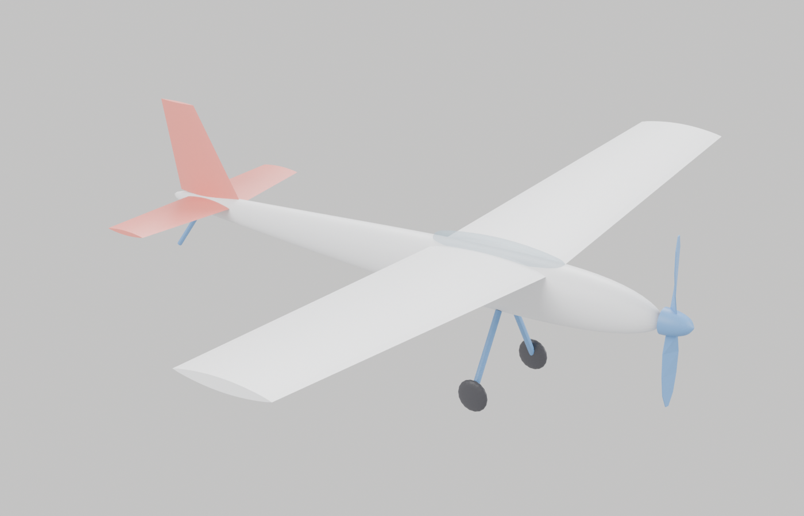

# A basic plane, in Blender



```
blender/basic_plane.py      the model
blender/render_preview.py   camera, lights, previews, saves the .blend
blender/basic_plane.blend   ready to open
```

## Running it

**In Blender:** Scripting tab → Open → `basic_plane.py` → Run Script (Alt+P).

**Headless:** `blender --background --python blender/render_preview.py`

**Without Blender installed:** `pip install bpy` gives you the same API as a
plain Python module, which is how the previews here were made — no GUI, no GPU.
Note that EEVEE needs a display, so `render_preview.py` uses Cycles on CPU.

## Changing it

Everything is in the `P` dictionary at the top of `basic_plane.py`, in
millimetres:

```python
P = {
    "span": 1200.0, "root_chord": 200.0, "tip_chord": 150.0,
    "dihedral": 4.0, "fus_len": 900.0, "tail_span": 380.0,
    "prop_dia": 254.0, ...
}
```

Change a number and run it again. The script deletes its own collection first,
so re-running replaces the model instead of stacking duplicates.

## How it is put together

Nine named objects in a `Plane` collection, each with a material:

| | |
|---|---|
| `Fuselage` | lofted elliptical stations, subdivided and shade-smoothed |
| `Canopy` | separate transparent object |
| `Wing`, `Tailplane` | lofted root→tip, Mirror modifier on Y |
| `Fin` | the same loft function with `vertical=True` |
| `Spinner`, `Propeller` | blades lofted along the radius with real pitch, β = atan(pitch / 2πr) |
| `GearLeg`, `Wheel`, `TailSkid` | `strut()` builds a tube between any two points |

Two helpers do most of the work: `loft()` joins rings into a tube, and
`plate()` returns a rounded section. Swap `plate()` for a NACA generator and
every surface becomes a real aerofoil without touching anything else.

Surfaces use a Mirror modifier rather than mirrored geometry, so editing one
side updates both — and the modifiers are left unapplied so they stay editable.
