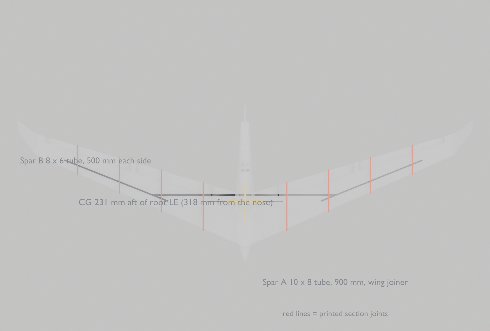
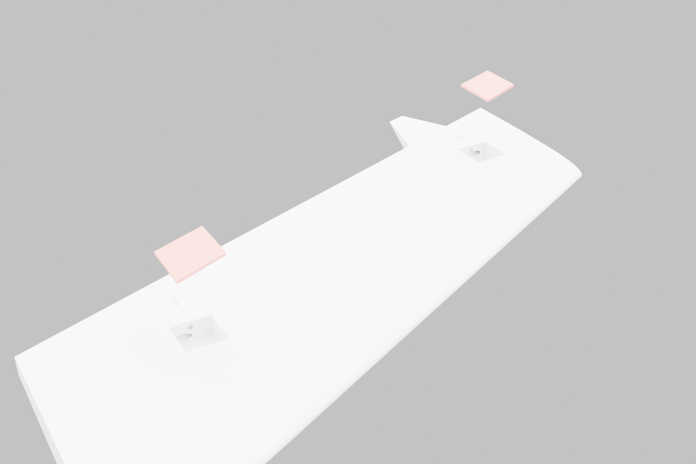

# Building it

2060 mm swept flying wing, 33 printed parts, 50 mm EDF. Target all-up weight
**1124 g** at **29.8 g/dm²**.

---

## The one number that matters

**CG: 318 mm back from the nose**, or **231 mm back from the wing root
leading edge** — the same point, measured two ways. Use the root leading edge
if you can; it is a sharp feature and the nose is a curve.

Tolerance **±5 mm**. On a tailless aircraft the CG is not a preference, it is
the difference between an aeroplane and an accident: the neutral point is only
**14.5 mm** behind it. Go aft of that and nothing you do with the sticks will
bring it back.

**Set it nose-heavy for the first flight** — 10 mm forward of the mark. It
will feel slightly reluctant in pitch and want to fly a little fast. That is
what you want. Move it back 3–4 mm at a time afterwards.

---

## What you need besides the prints

### Carbon

| | | |
|---|---|---|
| **Spar A** | 10 × 8 mm tube | **900 mm** — one piece, through the centre |
| **Spar B** | 8 × 6 mm tube | **500 mm** × 2 |
| **Anti-rotation** | 4 mm rod | **380 mm** |
| Dowels | 3 mm rod | ~500 mm, cut into 14 mm pins (you need 28) |

Spar B is 8 mm OD; Spar A is 8 mm ID. **B slides inside A.** That is why those
two sizes and no others.

### Power

| | |
|---|---|
| EDF | 50 mm 12-blade, QF2611 5000KV (fixed, non-retracting) |
| ESC | 40 A minimum, with a **brake-off / coast** setting |
| Battery | 4S 2200 mAh, around 190 g |
| Servos | 4 × 9 g SG90 (wing) + **1 × 9 g MG90S, metal gear** (rudder) |
| Receiver | 6 channel minimum |

### Consumables

30-minute epoxy (spar bonds and joints), thin CA (tacking), 20 mm fibre-reinforced
tape or Blenderm for hinges, sandpaper 240/400, isopropyl alcohol.

---

## Printing

LW-PLA throughout. Starting point, not gospel:

| | |
|---|---|
| layer | 0.2 mm, 0.4 mm nozzle |
| walls | 2 perimeters on wing sections, 3 on fuselage |
| infill | 4–6% gyroid in the wing, 0% in the fuselage shells |
| top / bottom | **0 on wing sections** — the perimeters *are* the skin |
| supports | none needed in the orientations supplied |

Open `blender/jetwing-parts.blend` and every part is already standing the way
it prints. Nothing needs rotating.

**Print one wing section first and check the spar slides through** before
committing 30 hours to the rest. Bores are cut +0.4 mm oversize; if yours come
out tight, run a 10 mm drill through by hand rather than reprinting.

---

## 1. Wing — dry fit everything first

Lay all ten wing sections out in order, both wings, and **thread Spar A
through dry**. No glue yet.

1. Slide Spar A through the two root sections (`wing_R1a`/`R1b` and the
   matching L). It should pass through both and stand proud 450 mm each side.
2. Add sections 2 and 3 on each side over the protruding spar.
3. Slide **Spar B** in from each tip end — it goes *inside* Spar A for the
   first 70 mm, then carries on out to section 4.
4. Push the whole lot together. Sight down the leading edge from the tip.

**Check now, while you still can:** both panels should show the same dihedral
and the same washout. The tips sit about 36 mm above the root, and each tip
trailing edge sits **2° nose-down** relative to the root. That washout is
designed in and it is what stops the tip stalling before the root — do not
sand it out trying to make the wing "straight".

Only when the dry fit is right:

5. **Epoxy Spar A into the root sections only.** Leave the outboard sections
   dry for now.
6. Fit the **4 mm anti-rotation rod** across the centre at 62% chord. It will
   only go in if both panels are at the same incidence — which is the entire
   reason it is there. If it fights you, something is twisted. Fix that
   before glue.
7. Working outward one joint at a time: dry pins in, check alignment, then
   epoxy. Two 3 mm dowels per face, 14 mm deep, either side of the spar.

Bond one joint at a time and let it go off. A wing built in one rush sets
with a twist in it.

---

## 2. Servos

Bays are printed in, so there is nothing to cut. Four of them: one per
control surface, in the **lower** skin, with a matching printed hatch.

| | station | in section | section depth there |
|---|---|---|---|
| flap servo | y = 300 mm | `wing_?2` | 21.0 mm |
| aileron servo | y = 570 mm | `wing_?3` | 17.1 mm |

**The servo lies on its side, output shaft pointing spanwise.** That way the
arm sweeps in a chordwise-vertical plane and drives the surface directly, and
the servo only costs 11.8 mm of section depth instead of 22.7. Mounted the
usual way up it does not fit in this wing at all.

**Why the bays are not under the control surfaces.** At the hinge line there
is only 11–15 mm of section, and a 9 g servo needs 14.8 mm with sensible
walls. So the bays sit at **45% chord** — just aft of the spar, close to
maximum thickness — and a pushrod runs aft to a horn on the surface. The
3.4 mm guide bore is printed in; use 2 mm rod inside a 3 mm tube.

A 9 g servo stops fitting outboard of about y = 730, which is why the aileron
servo sits at the inboard end of its surface rather than the middle.

**The hatch is a separate part and the servo screws to it.** Fit the servo on
the bench, then drop the whole assembly into the bay. Fishing a servo into a
closed pocket through its own hole is the worst job on a build like this, and
it leaves the servo unserviceable afterwards.

**Loom channel.** A 5 mm bore runs spanwise at 52% chord from the aileron bay
inboard to the root, straight through every joint, so the wiring threads
rather than being fished. It lines up to within 0.5 mm at the worst joint.
Thread the wires **before** you bond the sections together.

### Torque

| surface | worst case | needs | 9 g SG90 gives |
|---|---|---|---|
| aileron | 20° at 20 m/s | 0.29 kg·cm | 1.6 kg·cm ✓ |
| flap | 40° crow at 20 m/s | 1.08 kg·cm | 1.6 kg·cm ✓ |
| **rudder** | 25° at full throttle | **1.82 kg·cm** | **1.6 kg·cm ✗** |

The rudder sits in the EDF efflux, where dynamic pressure is **3060 Pa**
against 245 Pa outside — twelve times. A plastic-gear SG90 is undersized for
it. Use an **MG90S**: same size, same mounting, same bay, about 2.2 kg·cm.

Flap torque is worst with full crow at speed. Deploy crow on approach, around
12 m/s, where it falls to 0.39 kg·cm — not at 20 m/s.

## 3. Hinges

1. Sand the hinge faces lightly. The printed gap is 3 mm each side.
2. Tape hinges: one strip on top with the surface deflected fully down, one
   underneath with it deflected fully up. No slop, no gap for air to leak
   through.
3. Check free movement through the whole range before the servos go in.
4. Horn **in line with the hinge** — an offset horn gives you differential
   you did not ask for.

## 4. Fuselage and EDF

1. Bond `fuselage_1` to `_2` to `_3` to `_4` nose to tail. These are shells
   with a 1.2 mm wall; use epoxy sparingly, it is all weight.
2. **Fit the duct, fan and stator before closing the last section.** The
   motor wires come forward inside the duct.
3. Bellmouth inlets bond to the fuselage sides. The rounded lip faces
   forward — it is rounded for a reason, and a sharp or badly-fitted lip
   costs 10–20% of thrust.
4. Set the ESC to **coast, not brake.** A stopped fan is a flat plate across
   the duct and costs about 15% of your glide; freewheeling costs 10%.
5. Fin bonds to the fuselage top. The rudder sits behind the nozzle — that is
   the vectoring, and it is why the fin is that far aft.

---

## 5. Electronics and balance

Battery goes as far forward as it will go. It is the only mass with anywhere
useful to be, and it is how you reach the CG.

| | |
|---|---|
| wing shell + spars | ~510 g |
| fuselage | ~180 g |
| EDF unit | 109 g |
| ESC | 40 g |
| 4S 2200 pack | 190 g |
| 5 servos + RX + wiring | 57 g |
| hatches, horns, pushrods | 12 g |
| hardware, glue | 35 g |
| **total** | **~1120 g** |

**Balance it:** support the wing at 231 mm aft of the root leading edge, one
finger each side of the fuselage, battery fitted and canopy on. It should sit
level or very slightly nose-down.

If it is tail-heavy, move the battery forward. If it will not go far enough
forward, add lead *at the nose*, not amidships — a nose weight does the job
with a quarter of the mass.

---

## 6. Throws

Measured at the trailing edge of each surface, at mid-span.

| | low rate (first flights) | high rate |
|---|---|---|
| **elevator** (all four, together) | ±9 mm | ±14 mm |
| **aileron** (outboard pair) | ±10 mm | ±13 mm |
| **rudder** | ±17 mm | ±27 mm |
| **crow / brake** | flaps 35 mm down, ailerons 10 mm up | — |

Mixing, with a 6-channel set:

- **Elevator** → all four surfaces, same direction
- **Aileron** → outboard pair, opposite directions
- **Flap/crow** → inboard pair down, outboard pair slightly up, on a slider
- **Rudder** → its own channel

Add **15–20% expo** on elevator and aileron. The wing is quick in roll.

**Directions — check before every first flight:**

| stick | surfaces |
|---|---|
| pull back (up elevator) | all four trailing edges go **UP** |
| right aileron | right surface **up**, left **down** |
| right rudder | rudder trailing edge goes **right** |

Get the elevator direction wrong on a flying wing and it is over in two
seconds.

---

## 7. Before the first flight

- [ ] CG at 318 mm from the nose, or 10 mm forward of it
- [ ] Control directions checked on the aircraft, not in your head
- [ ] Throws on **low rate**
- [ ] Both wing panels at the same incidence — sight down from a tip
- [ ] Spar joints fully cured, not just tacky
- [ ] ESC set to coast
- [ ] Range check with the fan running
- [ ] Battery secured — a pack that shifts in flight moves the CG

## 8. First flight

Thrust-to-weight is **0.72**, so it will not climb out vertically. It needs a
proper launch.

Into wind, full throttle, **hard flat throw** slightly nose-down. Do not throw
it upwards — let it accelerate first. It wants about 10 m/s to fly properly
and stalls around **7.5 m/s (27 km/h)**.

Fly it out straight for a few seconds before touching anything but the
elevator. Trim in level flight at about half throttle.

Land it with a long flat approach and the crow brakes in. There is no
undercarriage; it lands on its belly, so pick grass.

---

## If something is wrong in the air

| | |
|---|---|
| **pitches up, feels twitchy, wants to tumble** | tail-heavy — land immediately, move the CG forward |
| **needs constant up elevator, wants to dive** | nose-heavy; add a little up trim, move CG back 3 mm next flight |
| **drops a wing at low speed** | one panel twisted — check incidence against the other |
| **rolls or yaws with throttle** | fan not square in the duct, or inlets unequal |
