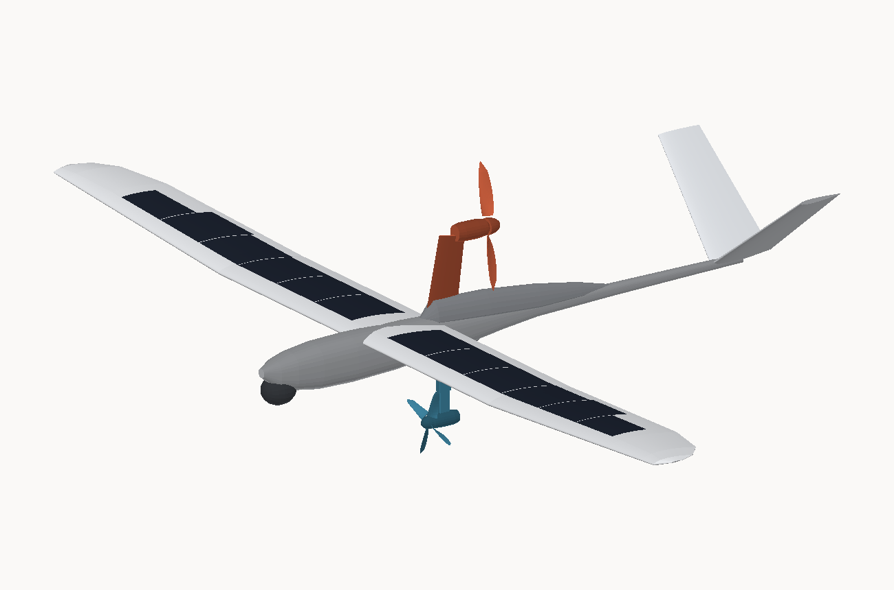
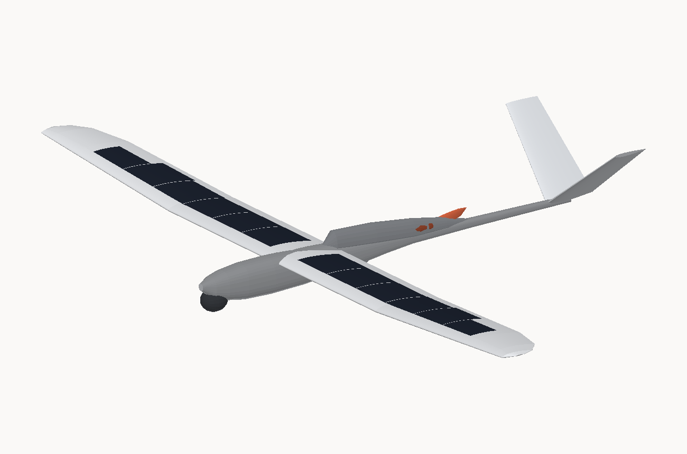
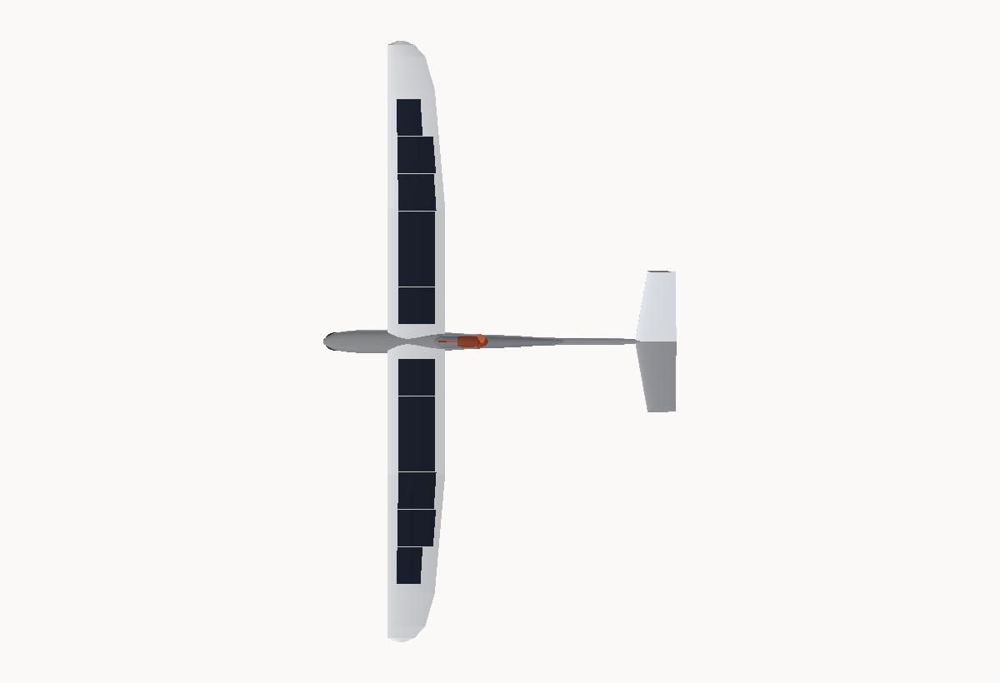
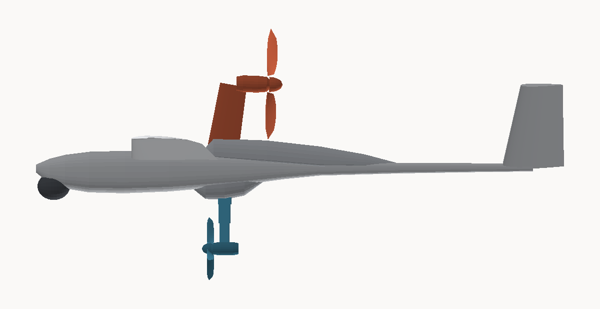
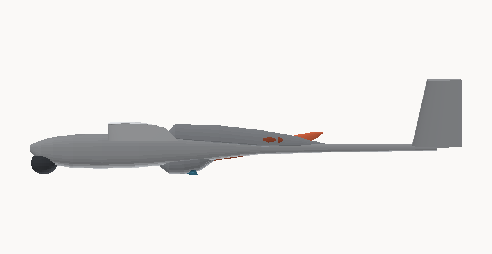
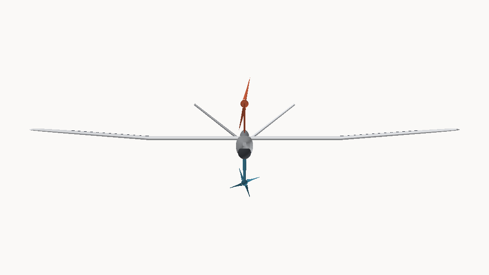

# FF-1 *Ember* — design plan

A 2 m span autonomous soaring glider for wildfire detection, with a retractable
motor pylon and a retractable energy-recovery turbine.

Every number quoted here is computed by `tools/analysis.py` from
`tools/config.py`. The full working is in [ANALYSIS.md](ANALYSIS.md).

---

## 0. Read this first — what the dynamo can and cannot do

The brief asks for a turbine-driven dynamo that charges the aircraft to
increase flight time. **A turbine cannot increase endurance in steady flight,
and no amount of engineering will change that.** It takes its power out of the
airstream, and that extraction appears as drag. Making 19 W electrically costs
30 W of shaft power, which at 20 m/s is 1.5 N of extra drag — about ten percent
of the aircraft's weight, dragging it down at 3.6 m/s instead of 0.52.

The energy accounting is unforgiving: you always put in more than you get back.

So the turbine is designed here as a **regenerative energy-recovery device**
with a hard control law, not as a charger. It has three honest jobs:

| Mode | When | Value |
|---|---|---|
| **A — surplus lift harvesting** | At the altitude ceiling with lift still available | 4–19 W, but needs a 1.3–5.6 m/s thermal. Opportunistic. |
| **B — regenerative descent** | Any commanded descent | 0.48 Wh per 500 m, and it replaces the spoilers the airframe would otherwise need |
| **C — emergency power** | Pack or array failure | 8.1 W at 15 m/s, against a 7.9 W hotel load — keeps the autopilot and the radio alive all the way down |

Mode C is the one that genuinely earns the turbine's 126 g. It is the same
argument that puts a ram air turbine in an airliner.

**The eight hours come from somewhere else: a solar array and autonomous
thermal soaring.** On batteries alone this aircraft flies for 1.4 hours. With
the array and thermals it flies for 10.0 hours in August at 38° N, and
10.0 hours in late June at 51.5° N — the target is met with 25 % margin.

Everything below is built on that.

---

## 1. Configuration



Pod-and-boom fuselage, shoulder-mounted three-panel wing, V-tail. Both
deployable pods retract into the fuselage: the motor pylon folds aft into a
dorsal spine, the turbine arm folds forward under the keel.



*Stowed: a clean sailplane. This is the configuration it spends most of the
mission in.*

| | |
|---|---|
| Span | 2.00 m |
| Wing area | 0.3580 m² |
| Aspect ratio | 11.17 |
| Mean aerodynamic chord | 181.8 mm |
| Length overall | 1.19 m |
| MTOW | 1622 g |
| Wing loading | 44.4 N/m² (4.53 kg/m²) |
| Aerofoil | FF-SC1, 9.48 % thick, 2.76 % camber — a solar-flattened SD7037-class section |
| Best glide | **L/D 17.6 at 9.5 m/s** |
| Minimum sink | **0.51 m/s at 9.0 m/s** |
| Stall | 7.79 m/s clean, 7.00 m/s with flap |
| Powered cruise | 16.7 W electrical at 9.5 m/s |
| Climb | 89 W electrical for 2.5 m/s |
| Endurance | 10.0 h (38° N, August), 1.4 h on batteries alone |
| Survey coverage | 10.1 km²/h with 30 % sidelap; 81 km² per sortie |

### 1.1 Why this layout

**Shoulder wing, constant-chord centre panel.** The centre 900 mm is untapered
at 195 mm chord. This is not aerodynamics, it is solar packing: three 41.7 mm
cell strips need 125 mm of usable chord, and only a chord of 179 mm or more
provides it once the leading-edge curvature and the thin trailing edge are
excluded. Outboard of the break the chord tapers to 92 mm and the array drops
to two strips wide.

**V-tail at 38° dihedral.** Two surfaces instead of three saves mass and
wetted area, and — the reason that actually decided it — it keeps the tail
volume out of the way of the deployed turbine's wake and gives the folded
pylon somewhere to go without a fin root in the middle of it. Tail volumes
land at V_h 0.55 and V_v 0.031, both comfortably conventional.

**Sensor turret slung under the nose, not on it.** A ventral ball at
x = 40 mm keeps the fuselage nose free and gives the thermal core a clean
nadir view with no propeller in front of it. It also means Variant N (§8) is
geometrically available.

**Pusher prop on the pylon.** The prop disc sits 79 mm aft of the wing root
trailing edge and 36 mm above the boom at its lowest point. A tractor
installation at the same pylon height would put the blade tips into the wing
trailing edge.

### 1.2 Three-view






---

## 2. Aerodynamics

### 2.1 The aerofoil problem

Two requirements fight each other. A good low-Reynolds section at Re ≈ 110 000
wants generous upper-surface curvature to keep the laminar separation bubble
short. A monocrystalline solar cell wants to be flat, because bending it
cracks it.

The resolution is a **curvature-limited morph**. Start from a cambered base
section, then relax the upper surface between 19 % and 90 % chord until the
local radius everywhere exceeds 400 mm. `tools/airfoil.py` does this by
clamped Laplacian smoothing, which can only ever reduce curvature, so it
converges monotonically.

The result, FF-SC1, is 9.48 % thick at 28.1 % chord with 2.76 % camber at
44.8 % — geometrically very close to SD7037 (9.2 % / 2.6 %), which is a good
sign, because SD7037 is a known-good section in exactly this Reynolds range.
The flattening costs about 0.5 points of thickness and 0.2 points of camber
against the unmorphed base.

At R = 400 mm a 165 µm cell sees 0.021 % bending strain, roughly a factor of
seven below the fracture strain of cut monocrystalline silicon.

> **This is a mould definition, not a validated aerofoil.** FF-SC1 exists so
> the 3D model and the plug have exact geometry. Before cutting a mould, put
> SD7037 (or an AG40-series section) through the same morph, run it in
> XFOIL/XFLR5 at Re 90k–160k with N_crit 9, and confirm the drag bucket
> covers C_L 0.4–1.1. Drop the .dat file in `airfoils/`, point
> `WING["airfoil"]["dat_file"]` at it, and the whole model regenerates on the
> real section.

### 2.2 Drag

C_D0 = **0.0247** with both pods stowed, from a component build-up with a
15 % uncertainty margin. The wing profile is 45 % of it; the fuselage, tail
and the two bay fairings make up most of the rest.

Two entries deserve attention because they are self-inflicted:

- **Solar cell steps, 0.0012.** Cell edges and bus ribbons under the
  encapsulation are a surface-roughness penalty on the most important 70 % of
  the wing's upper surface. Flush-bonding the cells into a recess in the skin
  rather than laying them on top is worth roughly half of this.
- **The dorsal spine, 0.0011.** This is the permanent cost of being able to
  swallow the pylon. It is paid on every second of the flight, deployed or not.

At soaring C_L induced drag is 60 % of the total, so parasite-drag increments
are diluted. That is why deploying both pods only costs 6.7 % in sink rate
(§8) — much less than intuition suggests.

### 2.3 Reynolds number

Re at the MAC runs 91 000 at the stall to 180 000 at 15 m/s. This is the
regime where surface finish and transition behaviour decide the drag, not the
planform. Practical consequences:

- Wet-sand and polish the moulded surfaces. A 0.1 mm step at 20 % chord is
  worth more drag than a badly chosen taper ratio.
- Plan for **turbulator tape** at roughly 55–60 % chord on the lower surface
  if flight test shows a drag bucket that is narrower than XFOIL predicts.
  Leave the position to flight test; do not mould it in.
- Do not chase aspect ratio past about 12. The chord gets short, Re falls, and
  section drag rises faster than induced drag falls.

---

## 3. Structure

Carbon/foam wing, moulded pod, tapered carbon boom.

| | |
|---|---|
| Limit load factor | 5 g (ultimate 7.5 g) |
| Root bending moment | 16.9 N·m |
| Spar caps | 9 mm wide, 3 plies of 115 g/m² UD carbon at the root, dropped to 1 ply at 70 % semi-span |
| Root cap stress at limit | 343 MPa (≈ 700 MPa allowable, T700 UD) |
| Root EI | 51 N·m² |
| Tip deflection | 18 mm at 1 g, 91 mm at limit |

**The wing is stiffness-driven, not strength-driven.** The cap laminate is set
by wanting a flat, unstressed array — a flexing wing cracks cells and works
encapsulation seams open — long before it is set by stress. Do not thin the
caps to save the 30 g the stress margin appears to allow.

Wing construction, root to tip:

1. **D-box**: 45/45 biaxial carbon over the leading edge, wrapping to the spar.
   This carries the torsion, which matters because the array's mass is
   distributed and aft of the shear centre.
2. **Spar**: UD caps top and bottom at 30 % chord, separated by a vertical
   shear web of 45/45 glass. Caps are stepped, not tapered by sanding.
3. **Core**: 60 kg/m³ extruded polystyrene or Rohacell, hot-wire cut to the
   FF-SC1 section, relieved for the cell recesses.
4. **Skin**: 25 g/m² glass over the core aft of the spar, then the cell array,
   then the ETFE encapsulation as the outermost layer.
5. **Joiner**: 12 mm pultruded carbon tube in an aluminium sleeve at the
   centre-panel joints, with an anti-rotation pin 40 mm aft.

The three-panel wing exists so the aircraft fits in a 1.1 m case. The centre
panel carries the spar box and both bay structures; the outer panels are plugs.

---

## 4. Energy system

```
   solar array ── 3 strings ──► 3-channel MPPT ──┐
   (34 strips, 11.33 cells)                      │
                                                 ├──► 12 V bus ──► BMS ──► 3S1P 21700
   turbine ──► FOC regen controller ─────────────┤                        (52.8 Wh)
   (150 mm, 4 folding blades)                    │
                                                 └──► 5 V / 3.3 V rails ──► avionics,
   motor ◄── bidirectional ESC ◄──────────────────────                      payload
```

### 4.1 Array

34 strips (11.33 full-cell equivalents) on the wing, 1771 cm² of active cell,
**39.8 W nameplate at STC**. Cells are cut into thirds so the 125 mm dimension
runs *spanwise* — the only curvature a strip has to follow is the 41.7 mm
chordwise one, which is what §2.1 was for.

Installed chain efficiency is **15.5 %**, from 22.5 % cell efficiency after
encapsulation transmission (0.94), cell temperature (0.94), mismatch and
soiling (0.95), MPPT (0.955) and attitude/heading cosine losses (0.86). That
gives 27.5 W at 1000 W/m² on a horizontal wing, peaking around 29.6 W in
flight.

**Three independent strings on three MPPT channels**, not one. A banked turn
puts one wing panel into a different irradiance from the other; with a single
series string the shaded cells drag the whole array down to their current.
Bypass diodes every 7 strips as well.

A V-tail sub-array (+7.0 W STC) is laid out in the model but deliberately
**excluded from the energy budget** — the panels sit at 38° dihedral, their
cosine losses are much worse, and the budget closes without them. Treat it as
a growth item.

### 4.2 Pack

3S1P 21700, 52.8 Wh nameplate, **38.9 Wh usable** after 85 % depth of
discharge and a 6 Wh approach reserve.

Cell selection is set by the **climb** case, not by capacity: 89 W at 11.1 V
is 8.0 A, so cells must be rated ≥ 10 A continuous. The tempting
high-capacity, low-current 21700s are the wrong part — take the 5.0 Ah /
25 A cell over the 5.0 Ah / 7 A one.

### 4.3 Loads

Hotel load is **7.9 W**; powered cruise adds 15.1 W. So on the ground the
avionics and payload are 34 % of the powered demand and 100 % of the soaring
demand.

**On this aircraft a watt saved in avionics is worth more than a drag count.**
Concretely: duty-cycling the edge compute from 50 % to 25 % saves 1.2 W, which
is worth more endurance than a 15 % reduction in C_D0. Design the detection
pipeline around that — wake the compute board on a hardware threshold from the
thermal core, do not run inference continuously.

---

## 5. Motor installation

| | |
|---|---|
| Type | Retractable dorsal pylon, pusher |
| Pivot | x = 400 mm, on the fuselage deck |
| Pylon | 190 mm, 74 mm chord, 12 % symmetric section |
| Deployed | 80° from the deck; hub at x = 489 mm, z = +197 mm |
| Stowed | 5°; nacelle and folded blades lie in the dorsal spine to x = 772 mm |
| Motor | Outrunner, ~500 Kv on 3S, 52 g |
| Prop | 10 × 6 folding, 254 mm |
| Deployment penalty | ΔC_D0 0.0025 |

**Mechanism.** A four-bar linkage driven by a metal-gear micro servo through a
3:1 bellcrank, with an **over-centre lock at full deployment** so that in
flight the aerodynamic and thrust loads are reacted by the linkage geometry
and not by the servo. Deployment takes about 1.2 s. Bay doors are cammed off
the linkage itself — no second servo, and the doors cannot be open when the
pylon is not.

**Clearances** (verified by `tools/build_model.py`, which will refuse to
produce a model that violates them):
- Prop disc 79 mm aft of the wing root trailing edge.
- Lowest blade tip 36 mm above the boom.
- Stowed blades end at x = 772 mm; the spine runs to x = 820 mm.

**Thrust line** is 197 mm above the datum and slightly above the drag line, so
power-on pitches the nose down a little. 1.5° of down-thrust is built in to
reduce the trim change; expect to fine-tune this on the first flights.

---

## 6. Energy-recovery turbine

| | |
|---|---|
| Rotor | 150 mm, 4 folding blades, solidity 0.31 |
| Design point | λ = 2.5, C_p 0.36 |
| Generator | Low-Kv outrunner, ~380 Kv, 44 g |
| Controller | Field-oriented regen controller into the 12 V bus |
| **Mounting** | **VDM-1 vertical telescoping mast** — see [VERTICAL_MAST.md](VERTICAL_MAST.md) |
| Station | x = 425 mm, on the wing trailing-edge bulkhead |
| Stroke | 128 mm straight down, from 42.7 mm of micro-linear-actuator travel |
| Deployed | Nacelle at z = −175 mm; disc from −100 to −250 mm |
| Output | 8.1 W at 15 m/s, 19.3 W at 20 m/s, 37.7 W at 25 m/s |
| Deployment penalty | ΔC_D0 0.0033, plus the extraction drag |

**The rotor was resized during design.** A 110 mm rotor produced 1.3 W at
cruise speed and was not worth carrying. Power goes as R² and as V³, so the
fix was a bigger rotor and a rule that it only runs fast. Folding blades let a
150 mm rotor stow in a shallow ventral bay.

**The mounting changed too.** The original swing arm moved the pod 157 mm aft
on deployment, shifting the CG +12.9 mm — 7.1 % of mean chord, taking static
margin from 20 % down to 13 % at the moment the turbine extends. A mast that
only translates vertically shifts it by nothing, keeps the rotor axis aligned
with the flow through the whole travel, and makes deployment depth a
continuous variable. It costs +90 g and 3.4 % of sink rate. The full sizing,
including why 128 mm of travel has to telescope to fit inside a 73 mm deep
fuselage, is in [VERTICAL_MAST.md](VERTICAL_MAST.md).

### 6.1 Control law

This is the part that keeps the turbine from being a net loss. The turbine may
engage **only** when one of these is true:

```
A.  ceiling_hold:   altitude ≥ soar_ceiling
                AND vario_filtered ≥ 2.5 m/s
                AND airspeed ≥ 16 m/s

B.  regen_descent:  descent commanded by the mission planner
                AND altitude ≥ 150 m AGL
                AND state_of_charge < 92 %

C.  emergency:      bus_voltage < 10.2 V  OR  mppt_fault  OR  pack_fault
```

and it must disengage, and the arm must retract, when **any** of these is true:

```
    altitude < 25 m AGL          (mandatory — the rotor hangs 216 mm below
                                  the keel and there is no landing gear)
    airspeed < 14 m/s            (below this it costs more than it makes)
    state_of_charge > 97 %
    bank angle > 45° for > 3 s   (asymmetric inflow, blade root loads)
    any deployment fault
    airspeed > 20 m/s            (mast load limit -- see VERTICAL_MAST.md §7)
```

Implement the interlocks in the flight controller's Lua scripting layer, and
implement the 25 m AGL retract **as a hardware failsafe as well** — a servo
release on a discrete output, independent of the scripting engine.

### 6.2 What it actually returns

Over a full 8-hour sortie with, say, twelve 500 m regenerative descents, mode B
banks about 5.8 Wh — roughly 4 % of the mission energy. It is worth having
because it is energy you were going to throw away as drag anyway, and because
the turbine doubles as the airbrake, so the wing needs no spoilers and the
approach can be flown steep and slow.

Do not expect more from it than that.

---

## 7. Avionics and autonomy

| Function | Specification |
|---|---|
| Flight controller | ArduPlane on an F405/H743-class wing board, with airspeed and a good baro |
| Soaring | **ArduSoar** (`SOAR_ENABLE`), variometer-based thermal detection with Reichmann centring on an EKF thermal estimate |
| Navigation | GNSS with SBAS, magnetometer, airspeed (essential — the soaring controller needs energy rate, not just baro) |
| Link | 868/915 MHz LoRa telemetry for BVLOS command and hotspot reporting; a 2.4 GHz control link for the test phase |
| Payload compute | Low-power SBC, event-triggered, not free-running |

**Autonomous thermal soaring is not optional here.** The 8-hour requirement
closes on solar alone in good conditions, but the margin that absorbs a hazy
day, a cool morning or a dirty array comes from thermals. ArduSoar is mature,
in-tree and flight-proven on aircraft of this class; use it rather than
writing a soaring controller.

Key parameters to set: `SOAR_VSPEED` (climb rate to trigger thermalling — start
at 0.7 m/s), `SOAR_ALT_MIN` / `SOAR_ALT_MAX` for the soaring band (250–900 m
here), and `SOAR_POLAR_*` for the sink polar in §2 so the speed-to-fly logic
is right.

The survey pattern and the soaring controller must share an altitude budget.
The sensible architecture is: fly the survey lawnmower pattern as the default,
let ArduSoar interrupt it to climb when it finds lift, and resume the pattern
at the interruption point. Do not try to soar and survey simultaneously —
banking hard in a thermal wrecks the sensor geometry anyway.

---

## 8. Wildfire payload

| | |
|---|---|
| Thermal | LWIR radiometric microbolometer, 160 × 120, 57° HFOV, 50 mK NETD, 8–14 µm |
| Visible | Rolling-shutter module for smoke-plume cross-checking and geolocation |
| Survey altitude | 400 m AGL |
| Ground swath | 434 m |
| Ground sample distance | 2.71 m/pixel (7.4 m² per pixel) |
| Coverage | 10.4 km²/h with 30 % sidelap → **83 km² per 8 h sortie** |

### 8.1 Sub-pixel detection

A fire much smaller than one pixel still raises that pixel's apparent
temperature, because radiant exitance goes as T⁴. Computed properly — with the
Planck integral over the 8–14 µm band, which captures only 17 % of an 800 K
flame's emission against 38 % of the background's, so LWIR is the
*unfavourable* band here:

| Flame area | Pixel fill | Apparent pixel T | ΔT | ΔT / NETD |
|---|---|---|---|---|
| 0.05 m² | 0.7 % | 36.1 °C | +9.1 K | 182× |
| 0.10 m² | 1.4 % | 44.5 °C | +17.5 K | 350× |
| 0.50 m² | 6.8 % | 98.3 °C | +71.3 K | 1425× |
| 1.00 m² | 13.6 % | 148.9 °C | +121.9 K | 2437× |
| 4.00 m² | 54.3 % | 353.3 °C | +326.3 K | 6527× |

**The sensor is not the limit — clutter is.** Sun-baked rock, dark soil and
asphalt reach 55–70 °C on a summer afternoon, which is +28 to +43 K. Anything
below that is indistinguishable from hot ground in a single frame. The
realistic single-frame detection floor is **0.5–1 m² of active flame**, not
the 0.05 m² the raw NETD implies.

Getting below that needs the contextual approach the MODIS and VIIRS fire
products use, and it is worth implementing properly:

1. **Contextual thresholding** — compare each candidate pixel against the mean
   and standard deviation of a background window around it, excluding other
   candidates. A pixel is a candidate when it exceeds background by both an
   absolute threshold and 4σ of its own neighbourhood.
2. **Temporal persistence** — the aircraft moves, so a real hotspot is seen
   from several angles over several seconds while a sun-glint is not. Require
   3 detections in 5 frames after geolocation.
3. **Visible cross-check** — a plume is the highest-confidence discriminator
   available and costs nothing extra to look for.
4. **Solar geometry masking** — reject candidates whose position relative to
   the sun vector makes specular reflection likely.

Report hotspots as geolocated candidates with a confidence score over the LoRa
link. Do not attempt to make the aircraft the arbiter of what is a fire.

---

## 9. Mass, balance and deployment effects

MTOW **1622 g**, ±35 g RSS on the itemised total, with a 6 % growth allowance
already included. The energy system (pack, cells, encapsulation, MPPT) is the
single biggest group at 419 g — 27 % of the aircraft.

| | |
|---|---|
| Neutral point | 54.2 % MAC |
| **CG target** | **34.2 % MAC = 277 mm aft of the nose** (20 % static margin) |
| CG forward limit | 26.2 % MAC |
| CG aft limit | 42.2 % MAC |

The battery sits on a **sliding tray** at x = 160–235 mm precisely so the CG
can be trimmed without ballast; 212 g of pack moving 20 mm shifts the CG about
2.6 mm, or 1.4 % MAC.

Deploying either pod moves mass aft and away from the datum. Both are aft of
the CG, so both deployments trim slightly nose-up and both are mildly
stabilising in yaw. Trim the autopilot for the stowed case. **The deployment
transient, not the trimmed state, is what to watch on the first flights** —
schedule deployments at level cruise, never in a turn or on approach.

---

## 10. Trade study — is the deployable pylon the right answer?

| Option | MTOW | C_D0 stowed | L/D | sink | ΔC_D0 running |
|---|---|---|---|---|---|
| Deployable dorsal pylon (baseline, as requested) | 1622 g | 0.0247 | 17.6 | 0.540 m/s | 0.0025 |
| Nose folding prop (Variant N) | 1551 g | 0.0231 | 18.2 | 0.516 m/s | 0.0003 |

**Variant N is 71 g lighter, has 4.5 % less sink, and has no mechanism to
jam** — it deletes the pylon, its actuator, its doors and the dorsal spine
that swallows it. Because the sensor turret is ventral, the nose is free for a
folding prop.

The dorsal pylon buys three things in exchange:

- the prop disc is clear of the ground on a belly landing;
- the nose stays available if the ventral turret is ever outgrown;
- thrust acts above the drag line, so power changes pitch the aircraft less.

**The baseline keeps the pylon because it is what the brief asked for, and the
penalty is real but small.** If endurance is the only thing that matters,
build Variant N. The turbine's retraction is not in question either way — it
has to stow for landing regardless.

And for completeness: the whole retraction argument is worth less than
intuition suggests. Flying with *both* pods hanging out costs only 6.7 % in
sink rate, because at soaring C_L induced drag dominates. Retraction is right,
but it is not transformative.

---

## 11. Flight test plan

Do not fly the full system on day one. Six phases, each with a go/no-go:

| Phase | Configuration | Objective | Go criterion |
|---|---|---|---|
| **1. Glide** | No motor, no turbine, ballast to MTOW, bays faired over | Trim, CG, stall behaviour, measured sink polar | Measured L/D within 15 % of 17.6 |
| **2. Power** | + motor pylon, deployed and pinned | Climb rate, thrust line, prop efficiency | ≥ 2.0 m/s climb at ≤ 95 W |
| **3. Retraction** | + pylon actuation | Deployment/retraction cycles at altitude, transient magnitude | 50 cycles, no jam, transient < 5° pitch |
| **4. Soaring** | + ArduSoar enabled | Autonomous thermal detection and centring | Net altitude gain in a 30 min sortie |
| **5. Turbine** | + turbine, tethered ground run first | Power curve vs airspeed, drag penalty, 25 m failsafe | Measured P(V) within 25 % of §6; failsafe retracts every time |
| **6. Endurance** | Full system | 8 h sortie with payload | Lands with ≥ 15 % SoC |

Instrument phase 1 properly. A measured sink polar from a GPS-logged series of
stabilised glides at 7.5, 8.5, 9.5, 11 and 13 m/s is the single most valuable
data set in the programme — it validates or destroys the C_D0 build-up, and
every energy number downstream depends on it.

**Phase 5 is the dangerous one.** Ground-run the turbine on a vehicle-mounted
rig first, at 15 and 20 m/s, with the arm restrained. A blade shed at 6400 rpm
is a serious projectile. Balance the rotor, proof-load the folding hinges to
3× the centrifugal load, and fly the first airborne test over open ground.

---

## 12. Risks

| Risk | Effect | Mitigation |
|---|---|---|
| **Turbine deployed on landing** | Destroys the rotor, arm and probably the keel | Hardware failsafe at 25 m AGL, independent of the flight controller scripting; belly skid aft of the bay |
| **Cell cracking in service** | Progressive array output loss, hard to diagnose | Curvature-limited section (§2.1); electroluminescence-image the array before and after the first 10 flights |
| **Pylon jams deployed** | 6.7 % sink penalty, still flyable | Over-centre lock with a manual release; the aircraft must remain airworthy with both pods stuck out — it is, see §10 |
| **Optimistic prop efficiency** | 0.68 is a hopeful figure at this Reynolds number | Phase 2 measures it. If it comes in at 0.60, cruise power rises to 17 W and endurance falls about 8 % — the budget absorbs it |
| **Hotel load growth** | Directly erodes endurance | 7.9 W is a budget, not an estimate. Meter each rail on the bench and hold each subsystem to its line |
| **Thermal detection false alarms** | Operationally worse than a miss | Contextual + temporal + visible cross-check (§8.1); report confidence, never a binary |
| **Overcast or winter operation** | Endurance falls to roughly the battery-only 1.4 h | Not a design fix. This is a fair-weather, fire-season aircraft. State it in the ConOps |

---

## 13. Regulatory and safety

Two things need saying plainly.

**This is a real aircraft and the rules apply.** At 1.5 kg it sits in the sub-2 kg
class in most jurisdictions, but the mission — long endurance, beyond visual
line of sight, over remote terrain — is exactly the profile that requires
specific authorisation rather than the open/recreational category. In the UK
that means a CAA Operational Authorisation; in the EU, a Specific-category
authorisation under an SORA; in the US, a Part 107 BVLOS waiver. Rules change,
and my information has a cutoff — check the current requirements with your
national authority before the first BVLOS flight, not after.

**Never fly this near an actual active wildfire without explicit coordination
with the incident commander.** Firefighting aircraft operate low and fast in
smoke, and airspace over active incidents is restricted precisely because an
unexpected drone grounds the air tankers. A UAS sighting can halt aerial
firefighting for hours. The useful role for an aircraft like this is
**detection over unburnt ground during high fire-danger periods**, upstream of
any incident — not over a fire that already has a response.

---

## 14. Where to go next

1. Run SD7037 through the flattening morph and validate it in XFOIL. Replace
   FF-SC1 in `config.py`.
2. Build a one-panel wing section and electroluminescence-image the array
   before and after a bend test to confirm the 400 mm radius limit.
3. Bench the hotel load. It is the number most likely to be wrong and it hits
   endurance hardest.
4. Build the phase-1 glider. Everything else is refinement of a shape that has
   to fly well first.
