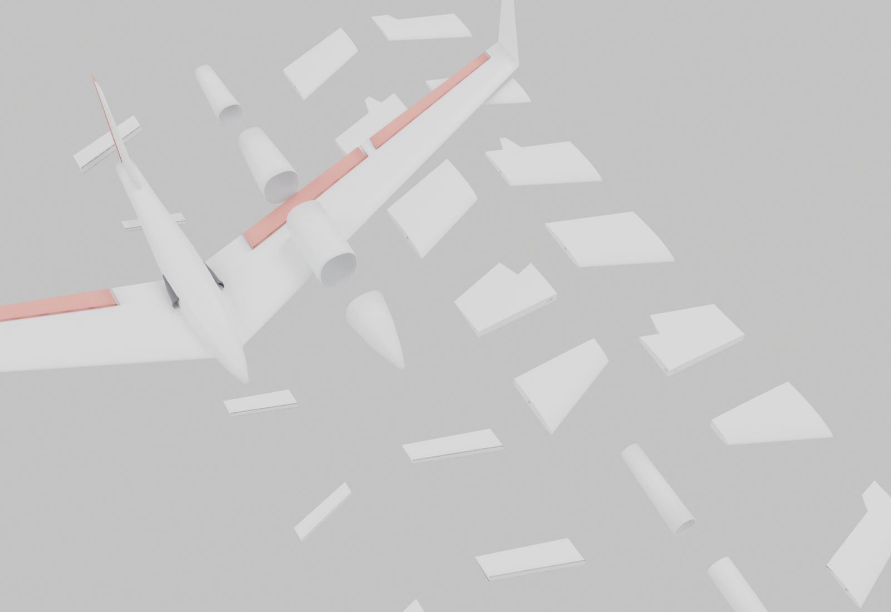

# Printing it on a Bambu Lab A1

```
python3 blender/print_parts.py      cuts the model up and writes print/*.stl
python3 tools/spar.py               the spar sizing behind the bore diameters
```



**33 parts, every one inside 256 mm, every one watertight.**

## What the build volume forces

The A1 gives 256 × 256 × 256 mm. The root chord is **260 mm**, so the root
section does not fit on the bed square on — it has to go diagonally, or be
split. Both happen below.

Wing sections print **standing on end, span axis vertical**. That:

- puts the spar bore straight up Z, so it needs no support and comes out round
- lays the layer lines across the chord, where the skin wants them
- makes the limit **256 mm of span**, not of chord

Five sections per wing at 206 mm each covers 1030 mm of semi-span with room
for the joint faces. The root section is still 303 mm across its chord plus
sweep, so it is split again chordwise into `wing_R1a` / `wing_R1b`.

## The carbon

Sized in `tools/spar.py` from the actual span loading, not a rule of thumb:
**19.8 N·m of root bending at 9 g ultimate** (6 g limit × 1.5), with the
lift distribution taken from the lifting-line solution for this planform.

| | | |
|---|---|---|
| **Spar A** | 10 × 8 mm tube, **900 mm** | root spar *and* wing joiner, centred |
| **Spar B** | 8 × 6 mm tube, **500 mm**, one per side | inserts 70 mm inside A |
| **Anti-rotation** | 4 mm rod, **380 mm** | across the centre at 62% chord |

Spar B is 8 mm OD and Spar A is 8 mm ID, so B **telescopes inside A** — that
is why those two sizes and not any other pair. Bores are cut at **+0.4 mm on
diameter** for a sliding fit after shrinkage; if your printer runs tight,
open them with a drill rather than reprinting.

Why it steps down: the wing gets thin outboard. At the 106 mm tip and 10.5%
thickness there is 11.1 mm of section to put a rod in, and a 10 mm rod leaves
no wall at all. Strength is not the binding constraint past mid-span — room
is. The moment at 80% span is 0.3 N·m, which a 4 mm rod carries easily.

**The anti-rotation rod is not optional.** One round tube, however well
fitted, lets the panels rotate about it, and a wing panel at the wrong
incidence is a wing panel that does not fly.

## Parts

Each joint face carries two 3 mm dowel holes, 14 mm deep, either side of the
spar — so a section cannot rotate while the glue goes off.

```
part                       X       Y       Z   faces  fits 256?  watertight?
  aileron_L1            85.6   135.3    22.2     982      yes      yes
  aileron_L2            80.4   135.3    19.9     982      yes      yes
  aileron_L3            75.2   135.3    17.7     982      yes      yes
  aileron_R1            85.6   135.3    22.2     982      yes      yes
  aileron_R2            80.4   135.3    19.9     982      yes      yes
  aileron_R3            75.2   135.3    17.7     982      yes      yes
  flap_L1              115.1   182.4    30.0     982      yes      yes
  flap_L2              108.0   182.4    27.0     982      yes      yes
  flap_R1              115.1   182.4    30.0     982      yes      yes
  flap_R2              108.0   182.4    27.0     982      yes      yes
  fuselage_1           174.0    94.1   103.4     148      yes      yes
  fuselage_2           174.0    98.4   113.9     148      yes      yes
  fuselage_3           174.0    93.6   100.5     148      yes      yes
  fuselage_4           174.0    68.0    73.2     170      yes      yes
  part_Ducta           197.0    52.0    66.0     171      yes      yes
  part_Ductb           197.0    52.0    64.4     118      yes      yes
  part_Fin             186.7    14.4   202.0     485      yes      yes
  part_Inlet            99.4   125.5    38.5     440      yes      yes
  part_Motor            78.9    26.0    27.6      86      yes      yes
  part_Rudder          139.7    14.4   227.9     485      yes      yes
  part_Stator           21.9    47.5    47.9      98      yes      yes
  wing_L1a             151.8   206.0    32.3     656      yes      yes
  wing_L1b             151.8   206.0    29.8     869      yes      yes
  wing_L2              238.5   206.0    29.7    1406      yes      yes
  wing_L3              241.9   206.0    26.6    1443      yes      yes
  wing_L4              193.0   206.0    23.5    1415      yes      yes
  wing_L5              197.7   206.0    20.3    1419      yes      yes
  wing_R1a             151.8   206.0    32.3     656      yes      yes
  wing_R1b             151.8   206.0    29.8     869      yes      yes
  wing_R2              238.5   206.0    29.7    1406      yes      yes
  wing_R3              241.9   206.0    26.6    1443      yes      yes
  wing_R4              193.0   206.0    23.5    1415      yes      yes
  wing_R5              197.7   206.0    20.3    1419      yes      yes

  33 parts, 0 too big, 0 not watertight
  written to /home/user/Forever-Flight/print/
```

## Slicer

For LW-PLA on an A1, as a starting point rather than gospel:

| | |
|---|---|
| nozzle / layer | 0.4 mm / 0.2 mm |
| walls | 2 perimeters on wing sections, 3 on the fuselage |
| infill | 4–6% gyroid in the wing, 0% in the fuselage shells |
| top/bottom | 0 on wing sections — the perimeters are the skin |
| supports | none needed in these orientations |

The fuselage, duct and inlets are exported as **shells with a real wall**
(1.0–1.2 mm) rather than solid blocks, so the slicer is not hollowing out
something it then has to fill back in.

## Assembly order

1. Thread **Spar A** through both root sections, dry, and check the panels
   sit at the same incidence before any glue.
2. Slide **Spar B** into A from outboard, through sections 2 and 3.
3. Dowel and bond the wing sections outward from the root, one joint at a
   time, checking the tip stays in line.
4. Fit the **anti-rotation rod** last — it will only go in if the panels are
   already correctly aligned, which is the point of it.
5. Fuselage shells bond nose-to-tail; the duct goes in before the last
   section closes it up.

## How the parts are made

They are **generated from the parametric loft**, not cut out of the model.
Cutting was tried first and produced nonsense: the wing object is several
lofted runs merged into one mesh, so where two runs abut there are coincident
internal faces, and an exact boolean on a non-manifold mesh returns garbage —
sections came out with the wrong span and chunks missing.

Generating each section from the same maths the skin is made of is manifold
by construction and lands on the surface exactly. The spar bores are then
boolean-subtracted, which works because the sections are clean.

One subtlety that caused the same failure a second time: where a section sits
behind a control surface, the aft part of the aerofoil has to stop at the
hinge. Clamping the trailing points onto the hinge line piles a dozen vertices
onto one line and leaves sliver faces — invisible in a render, fatal to a
boolean. The sections are resampled to the hinge and closed with a deliberate
face instead.

Every exported part is checked for non-manifold edges before it is written.
