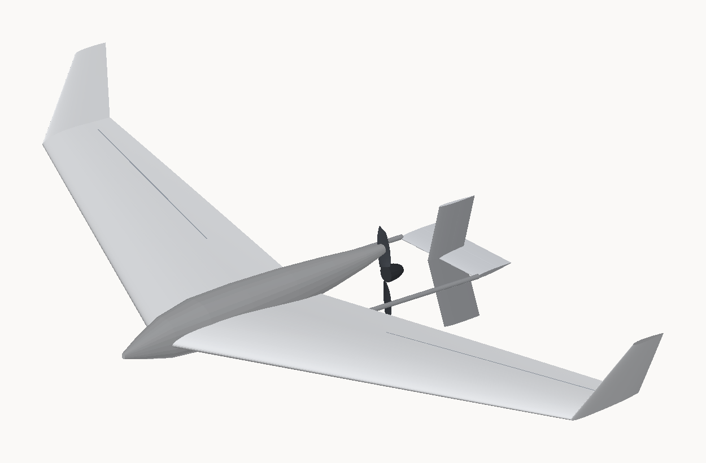

# VT-1 — a thrust-vectoring tail for the JW-1

Run it:

```
python3 tools/vectortail.py      # the sizing analysis and every number below
python3 tools/jetwing.py         # builds the -vt models
```

Models: `models/jetwing/jetwing-1500-vt.stl`, `jetwing-1200-vt.stl`.



## The idea

A control surface in free air makes force proportional to V². At 6 m/s it has
35 % of the authority it has at 10. That is backwards: you need the *most*
control when you are slowest — hand launch, climb-out, a botched thermal entry.

A vane sitting in the propeller's slipstream makes force proportional to the
**jet** speed, which stays high when the aircraft is slow because the prop is
doing the work. Deflect the jet and the reaction is a force on the aircraft —
thrust vectoring, done with vanes rather than a gimbal.

At 6 m/s on full throttle the jet carries **6.3×** the free-stream dynamic
pressure.

## Layout

| | |
|---|---|
| **twin booms** | 9 × 7.6 mm carbon at y = ±108 mm, *outside* the slipstream tube — they carry the load without paying jet drag |
| **cruciform** | on the thrust axis, *inside* the jet: horizontal vane for pitch, vertical for yaw |
| **rudder span** | the symmetric ±96 mm only, so a yaw input makes no rolling moment |
| **ventral fin** | deeper than the dorsal (137 mm), because it is also the skid that stops a pusher eating its propeller |
| **vane station** | 0.55 prop diameters aft of the disc |
| **tail arm** | 432 mm from the CG. V_h 0.0769, V_v 0.0144 |

## What it buys

| condition | pitch, vanes | pitch, elevons | yaw, vanes |
|---|---|---|---|
| hand launch, 6 m/s full throttle | **0.790 N·m** | 0.416 N·m | **0.789 N·m** |
| climb-out, 9 m/s | 0.926 | 0.937 | 0.900 |
| thermal circle, 7.5 m/s, motor off | 0.263 | 0.651 | 0.240 |

**1.9× the elevons at launch speed; 0.4× unpowered.** This *adds* to the
elevons, it does not replace them. And the JW-1 had no yaw control at all —
elevons give pitch and roll only.

## Four things the analysis found

**1. The JW-1's dorsal fin does nothing.** It sits 12 mm behind the CG and earns
V_v = 0.0005 — 227 cm² of surface for no directional stability. The winglets
(V_v 0.0118) were carrying the aircraft. The cruciform at a real arm earns
0.0144. Delete the dorsal fin; deleting it also pays back most of the new
tail's drag.

**2. Throttle coupling can be killed exactly.** The jet raises tail dynamic
pressure 2.35× at full throttle, so a loaded tail would pitch the aircraft
every time the throttle moved. But Cm_tail = −V_h·η_t·CL_t, so if **CL_t = 0 at
trim**, the trim change is zero whatever η_t does. Setting the tail to −5.74°
achieves it. Stability still rises with power, because dCm/dα keeps the η_t
factor. Off-design it costs about 1° of trim per 2° away from the trim angle.

**3. Setting the tail unloaded at trim makes the aircraft *slower*, for free.**
A tail unloaded at trim is nose-up-loaded at low α, which adds to Cm0 and raises
trim C_L from 0.366 (tailless) to **0.583** — trim speed 10.2 → 8.4 m/s. For a
soaring aircraft that is the right direction. It sits at 1.21× stall, so trim
nose-down for cruise.

The alternative — cutting the wing's reflex and letting the tail carry a
download — was computed and is *worse*: it raises trim speed and reintroduces
throttle coupling. **Leave the wing exactly as it is.**

**4. A heavier boom is worse.** First bending mode is 62 Hz, and both propeller
forcing crossings (1P at 3736 rpm, 2P at 1868) fall *below* the sustained
running band, so they are transient on spin-up. Stiffening to an 11 mm tube
lifts f1 *into* the band. Counterintuitive, and checked.

## What it costs

- **+54 g net** (65.6 g added, 12 g of dorsal fin deleted) — AUW 880 → 934 g
- **+0.00104 on C_D0**, so best-glide sink +2.5 %, min-sink +1.4 %
- **the balance does not come free.** The CG moves aft 26.1 mm while the tail
  only moves the neutral point aft 7.2 mm. The 248 g pack has to move **72 mm
  forward**, from 105 mm to 33 mm behind the nose. That is a nose-bay change,
  not a bolt-on. Budget for it before cutting any carbon.

## The 1200 does not close

At 1200 mm the servos, horns and linkages do not shrink with the airframe, so
the tail is 9.1 % of AUW instead of 7.5 %, and there is not enough pack mass to
balance it. It needs a **167 g pack (+79 g) in the nose, or 169 mm more nose**.

Do not shrink the tail to dodge this. A tail you cannot balance is not worth
fitting.

## Method

- Propeller: T = C_t ρn²D⁴, C_t and C_p falling linearly with advance ratio,
  calibrated against the published APC 7×4E static point (model gives 4.10 N on
  68.9 W at 10 000 rpm against roughly 4.2 N / 70 W published).
- Slipstream: momentum theory for the wake speed, McCormick's development law
  for how much of it has appeared at the vane station, continuity for the tube
  contraction. Strip integral across each vane so the part inside the jet gets
  jet dynamic pressure and the part outside gets free stream.
- Flap effectiveness: exact thin-aerofoil theory, dC_l/dδ = 2[(π−θ)+sin θ] and
  dC_m/dδ = ½ sin θ (cos θ−1). No tables.
- Trim: the wing's strip-theory solution from `tools/jetwing.py` with the tail
  added, downwash scaling with wing lift, neutral point and trim angle both
  found by bisection.

## Full output

```
== VT-1 : thrust-vectoring tail for the JW-1 ==

GEOMETRY
  twin booms  9 x 7.6 mm carbon at y = +/-108 mm
              269 mm free aft of the wing TE, 70 mm socketed into the spar saddle
              clears the blade tip by 14.5 mm static, 14.0 mm at full vane load
  vane station 0.55 prop diameters aft of the disc = 98 mm
  stabiliser  216 x 78 mm (168 cm2, AR 2.77), elevator 40% chord
  fin         96 mm up, 137 mm down (181 cm2), rudder on the symmetric +/-96 mm only, so yaw makes no roll
  tail arm    432 mm from the CG   V_h 0.0769   V_v 0.0142

DIRECTIONAL STABILITY -- and a problem this found in the JW-1
  dorsal        227 cm2 at arm   +12.5 mm -> V_v 0.00051
  winglets      279 cm2 at arm  +233.8 mm -> V_v 0.01184
  cruciform     181 cm2 at arm  +431.6 mm -> V_v 0.01420
  The JW-1 dorsal fin sits 12 mm behind the CG. It is 227 cm2 of
  surface earning V_v 0.00051 -- essentially nothing. The winglets were
  carrying the aircraft. Delete the dorsal fin; the cruciform replaces it
  28 times over and brings a rudder, which the JW-1 did not have.

CONTROL AUTHORITY        pitch, N.m          yaw, N.m   equivalent
                      vanes   elevons  ratio   vanes    vector angle
  hand launch       0.790    0.416   1.90x   0.801        30 deg
  climb-out         0.926    0.937   0.99x   0.915        39 deg
  full-power dash   1.465    2.961   0.49x   1.389        70 deg
  thermal circle    0.263    0.651   0.40x   0.244         0 deg
  at the stall      0.210    0.519   0.40x   0.194         0 deg
  At 6 m/s the jet carries 6.3x the free-stream dynamic
  pressure, so the vanes beat the elevons 1.9x. Unpowered they are worth
  about 0.4x an elevon: this ADDS to the elevons, it does not replace them.

THROTTLE / TRIM COUPLING
  The jet raises tail dynamic pressure 2.35x at full throttle.
  Setting the tail -5.74 deg so it carries ZERO load at trim makes
  the trim change EXACTLY zero, because Cm_tail = -V_h.eta.CL_t and CL_t = 0
  kills it whatever eta does. Stability still rises with power.
    +0 deg off trim -> CL_t +0.000 -> -0.00 deg shift on throttle
    +2 deg off trim -> CL_t +0.058 -> -1.01 deg shift on throttle
    +4 deg off trim -> CL_t +0.117 -> -2.02 deg shift on throttle
    +6 deg off trim -> CL_t +0.175 -> -3.02 deg shift on throttle

TRIM, with the tail in the loop
  tail incidence -5.74 deg, neutral point 216.9 mm
  The tail is unloaded at trim but nose-up loaded at low alpha, which
  RAISES the trim CL from 0.366 (tailless) to 0.583:
    static margin   CG from nose   alpha    CL     trim speed
        4.0%            280 mm   15.55  1.101    6.08 m/s
        6.0%            274 mm   11.02  0.731    7.46 m/s
        7.5%            271 mm    9.21  0.583    8.35 m/s  <- design
        9.0%            267 mm    8.01  0.484    9.17 m/s
       12.0%            259 mm    6.50  0.361   10.62 m/s
  Stall 6.92 m/s, so the design point sits at 1.21x stall -- deliberately slow,
  which is what you want for soaring, but trim nose-down for cruise.

MASS AND BALANCE
    carbon booms, 2 off          19.2 g   arm  +318.3 mm
    stabiliser + elevator         8.4 g   arm  +447.2 mm
    fin, ventral + rudder         9.8 g   arm  +447.2 mm
    skid shoe, replaceable        2.2 g   arm  +447.2 mm
    servos, 2 off 5 g            10.0 g   arm  +447.2 mm
    horns, links, pushrods        4.2 g   arm  +447.2 mm
    mass balance, lead            3.8 g   arm  +447.2 mm
    boom sockets + bonding        5.0 g   arm  +130.3 mm
    servo extension wire          3.0 g   arm  +291.2 mm
    added                        65.6 g, less dorsal fin -12.0 g = net +53.6 g
  AUW 880 -> 934 g (+6.1%)
  CG moves aft 26.1 mm; the tail only moves the NP aft 7.2 mm,
  so the balance does NOT come free: the 248 g pack has to move from
  105 mm to 33 mm behind the nose -- 72 mm FORWARD. That is a nose-bay
  change, not a bolt-on. Budget for it before cutting any carbon.
  Balance CLOSES at this span.

DRAG, which is what the glide pays
    booms, 2 off               +152 cm2 wetted  cf.FF +0.00423
    stabiliser                 +337 cm2 wetted  cf.FF +0.00761
    fin + ventral              +363 cm2 wetted  cf.FF +0.00761
    dorsal fin DELETED         -454 cm2 wetted  cf.FF -0.00501
  net dCD0 +0.00104 on wing area (the deleted dorsal fin pays back most of it)
    best glide  L/D 15.2 -> 14.8, sink +2.6%
    min sink    L/D 13.3 -> 13.1, sink +1.5%

STRUCTURE
  worst vane load 4.64 N (full deflection, full throttle, 2.5 g)
  tip deflection 0.73 mm, 0.52 mm at the prop plane
  first bending mode 62 Hz
  1P crosses it at 3714 rpm, 2P at 1857 rpm; sustained band is
  4000-10500 rpm, so both crossings are below it -- transient on spin-up only.
  Counterintuitive but checked: a HEAVIER boom is worse here. Stiffening
  to 11 mm lifts f1 into the running band instead of clearing it.
  mass-balance the elevator: 0.85 g at 43 mm ahead of the hinge
  mass-balance the rudder: 0.75 g at 43 mm ahead of the hinge

PROPELLER GUARD
  A pusher eats its prop on landing. The blade tip reaches 89 mm below the
  thrust axis; the ventral fin reaches 137 mm, so at a 8 deg nose-up touchdown
  the blade clears the ground by +12.5 mm. GUARDED.
  That is why the ventral is deeper than the dorsal, and why the rudder
  stops at +/-96 mm: the extra depth is skid, not control.
```
